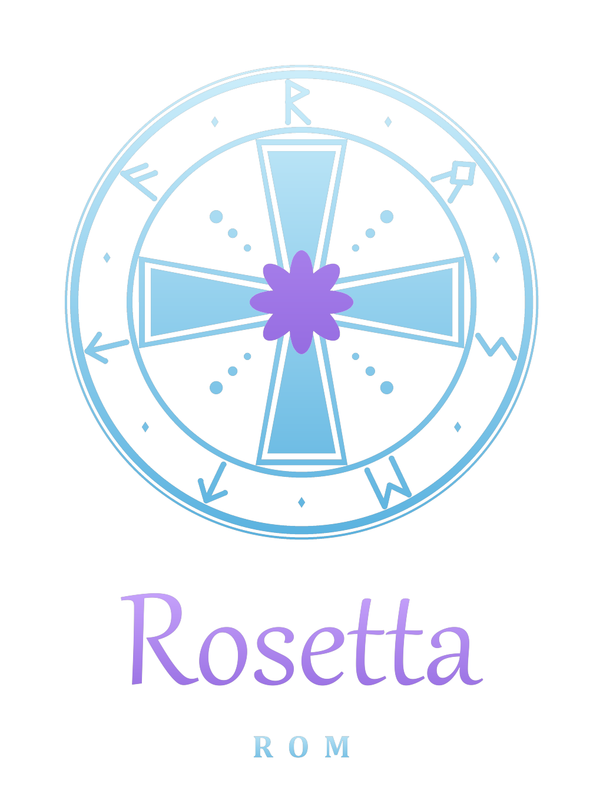

<p align="center"></p>

# D-110 Rosetta OS

New firmware features for the **Roland D-110**: an OS mod on the socketed OS EPROM (IC19) plus new code in the
control ROM (IC15). Arpeggiator, step sequencer, chords, unison, mono/glide, mod matrix, wave sequencing, Lab sound
hacks and more, all from a menu on the front panel.

The sample side (your own waves in IC7 / IC8 / IC15) lives in [Rosetta ROM](https://github.com/yuyoi/rompler-rosettarom)
(Rosetta Studio). This repo is the OS part, moved out of there with its tools and tests.

**Legal:** this repo contains no Roland code or ROM data. You read **your own** chips, the tools add the new bytes
to your dumps. Please don't share patched / baked .bin files: share this repo instead.

**Quick start:** dumps into `roms/`, then `python bake_rosetta.py --test` -> burn files in `baked/` (see below).

## Rosetta two-chip mod (IC19 + IC15)
**Easiest: the ROM baker.** Put your own IC19 dump in `roms/IC19 (main OS EPROM)/` and the IC15 file from Rosetta
Studio (or your plain IC15 dump) in `roms/IC15 (bin from Rosetta Studio here)/`, then run
`python bake_rosetta.py` (add `--test` to run the simulator checks first). `baked/` gets the burn files for IC19
(27C256, or a W27C512 / 27C512 with the image doubled) and IC15 (SST39SF040 x4, or 128 KB for an SST39SF010A) and
`BURN.txt` with the MD5s. The tool and this repo contain only the new code; don't share the baked .bin files.

**v8 on hardware (user test):** boots, the Info line reads `Mem oooo P01 v8` (all RAM spots ok), the Lab items work
(see Lab). The rest of v8 (arp, unison, glide, LFO, wave seq, saved settings) is not reported yet.
**v9 on hardware:** user: "it all looks great and seems to work well" (no feature-by-feature report yet).
**v10 (menu layout, banner, Mod / Lab On-Off), v11 (Lab Motion) and v12 (Seq Record live counter + Done) are
simulator-only.** They keep the v9 settings and sequence (v11 adds its own defaults). v11 backup: git tag
`rosetta-v11`.
v6 plus new features whose code lives in IC15 page 0x27: code at IC15 0x1C000-0x1EFFF (the end of the demo songs,
unused once the Quick mod has replaced the demo menu), the jump table at 0x1F000 and data after it (0x1F020-0x1FFFF).
IC19 gets only small hooks. With a stock IC15 the hooks find no magic word and the unit behaves exactly like v6.
IC19 is the same in v8 to v12 (MD5 `08ebae6e...`): later versions only need IC15 reburned.
- **Rosetta menu:** on the Quick screen press **Edit**. Group +/- = item, Bank +/- = value -/+1, Number +/- = -/+10,
  Part = current part (P1-P8, also on the Quick screen), Exit = back. One line per feature; items marked `>` have a
  **submenu** with all their settings: Edit opens it, Group +/- moves inside it, Exit (or Edit) goes back. Top level:
  Wave Scan, Wave Seq >, Random >, Vintage >, Glide Time >, Mono Part >, Unison Voices >, Chord >, Mod Matrix >
  (On / Off), Arp Mode >, Lab > (On / Off), Info. Edit on Wave Scan / Info = next section. Settings are kept in
  battery RAM (survive power-off). Info = memory test of the RAM the mod uses (`o` = ok, `X` = bad), part byte,
  version.
  - **Wave:** Wave Scan (CC70, per part, live), Random Wave, **Wave Seq >** (Up 4, Up 8, Down 4, Ping 8, Octo,
    Strobe, Once 4, Random, User; inside: Speed, Part, User 1-8). The sequence steps the PCM wave of each note over
    time (Wavestation style); the pitch follows each wave's tuning.
  - **Random >:** Drift Pitch, Random Wave, Random Cutoff (new values for every note).
  - **Pitch:** **Vintage >** (0-99, inside: Vintage Part): every note wanders slowly in pitch (up to
    about +-28 cents at 99) and cutoff, each note its own way, **Glide Time > / Glide Part**, **Mono Part > / Legato**.
  - **Voice:** **Unison Voices >** (1-4; inside: Detune, Part), **Chord >** (Octave ... Dim, **Learned**, **Scale**,
    **Scale 7**; inside: Chord Part, **Chord Learn**, **Scale Key**, **Scale Type**). Chord Learn: Bank+, play a
    chord on the Chord Part, let go: the chord is learned (up to 5 notes) and Chord = Learned, one key plays it.
    Scale / Scale 7: one key plays the triad / 7th chord of the key and scale (Major, Minor, Dorian, Phrygian,
    Lydian, Mixolydian, Locrian, harmonic / melodic minor) on that degree.
  - **Mod Matrix >** (On / Off; inside: Mod1-4 Source (ModWheel, AftTouch, Velocity, Key, LFO, S&H, CC16, CC17),
    Dest (Cutoff / Pitch / Wave / Level / Reso), Amount -63..+63, LFO Rate, **LFO Sync** (Off or 4 bars ... 1/16T, on MIDI
    clock or the arp tempo; the S&H steps with it), Mod Part. Velocity -> Wave = velocity layers.
  - **Arp:** **Arp Mode >** (Up, Down, Up+Down, Random, Played, **Seq**; inside: Octaves, Rate 1/4 .. 1/32, Tempo
    40-240 BPM, Gate, Latch, Part, **Arp MIDI Out** Off / On / Only, Seq Record, Seq Length, Chance %, Ratchet
    2x-4x / Random, Octave Jump %, Accent every 2/3/4 / Random, Euclid Hits / Steps, Humanize Time / Vel). Syncs to MIDI clock when one is received (start resets the pattern). Arp notes go
    through mono, chord, unison and glide too.
    - **Seq:** a recorded pattern of up to 32 steps (notes, rests, ties), kept in battery RAM; the last key held
      transposes it (the first recorded note = that key). A demo pattern is there from the start.
      Seq Record: Bank+ = Step record (each key = one step; Number+ = rest, Number- = tie), Bank+ again before the
      first key = Live record (the first key starts the arp clock, keys go to the nearest step, a held key = tie),
      Bank- = stop (the steps so far become the pattern). The display counts live while you play (`Step 05/32`),
      and shows `Done 05/32` when the recording has stopped (Bank- or 32 steps full).
    - **MIDI Out:** arp notes also go out of MIDI OUT on the arp part's channel (Only: not played inside).
  - **Lab > (experiment, On / Off):** Lab Reso High (bits 5-7 of the LA32 resonance byte that Roland ties to the reso value),
    Lab Reso Low (bits 0-4, including 0 and 31 that Roland never uses), Lab Ctrl XOR (0-255: flips the control byte
    of synth partials; bit 7 = "PCM"), Lab PCM XOR (control byte of PCM partials), Lab PCM Pos (flips the sample
    position bits: other samples / other memory), Lab Part (All or one part).
    **Lab Motion** (in the Lab submenu): Motion Off / Up / Down / Ping / Random changes a value 0..Motion Range by
    Motion Step at Motion Rate (Note = every new note, or 1/1 .. 1/64 on the arp tempo / MIDI clock; the first clock
    after MIDI start steps) and XORs it into Motion Dest (PCM Pos, Ctrl XOR, PCM XOR or All) on top of the Lab values.
    Retrigger On: every step plays the held notes of the Lab parts again (whole chords / unison voices; mono legato
    follows the moved note), so one held key runs through new positions / transients as a stutter.
    **Hardware (v8):** Lab Reso High 7 (bits 5-7 = 110) gives much stronger resonance than the stock maximum.
    Lab Ctrl XOR 8 (bit 3) with Reso High 7: the note is replaced by a transient wind (noise) sound. Every XOR value
    gives a different transient. Reso High 1-6 not reported yet. Ctrl XOR 64-255, Reso Low and the PCM items are new
    in v9 (untested).
  - Changing chord, unison, mono, legato, glide, vintage part, arp mode / part / latch / MIDI out settings sends all
    notes off.
- Timing: the arp tempo assumes the old demo tick is 2.08 ms (timer1 at 1.33 us). If the tempo is off on the unit,
  `TICK_MS` in `rosetta.py` is the one number to fix; MIDI clock sync does not depend on it.
- Build: `patch_ic19.py ... --quick --cc --rosetta --ic15-hook` and `patch_ic15.py my_ic15.bin -o my_ic15_ros.bin
  --rosetta` (your own IC15 dump; 128 KB or the 512 KB x4 burn file). The boot banner comes from IC15 when it is
  found, so the banner tells you if both chips are right. `python test_rosetta.py ic19_ros.bin my_ic15_ros.bin`
  runs it all in the simulator.

## D-110 OS mod v6: one EPROM swap (IC19 only)
The non-intrusive upgrade: one socketed chip, stock IC15/IC7/IC8, put the original back any time. v6 code =
commit `df82c2a` (the tools only change with a new version number). Bigger features that need IC15 come as a separate two-chip mod.

Works on a real D-110 (OS v1.10). It only changes IC19, the socketed OS EPROM, and works with a stock IC15/IC7/IC8.
- **Quick screen:** hold **Enter** + press **Edit** (this used to start the demo). Group +/- = filter cutoff,
  Bank +/- = resonance, Number +/- = attack, Part +/- = release. Each step moves all 4 partials of the current part.
  Part (plain button) = next part P1..P8. Exit = back. Cutoff and resonance change held notes live; attack/release
  apply from the next note. Cutoff/resonance only affect synth partials (SQU/SAW), not PCM.
- **MIDI CC knobs** (`--cc`, works on hardware): CC74 cutoff, CC71 resonance, CC73 attack, CC72 release,
  per part on its MIDI channel. Cutoff/resonance move held notes live, like the Quick screen. Other numbers:
  `--cc 74,71,73,72` order cutoff,reso,attack,release (only CCs the stock OS ignores).
- **Plain words:** WG/P-ENV/P-LFO/TVF/TVA... become OS/Pitch/Vibr./Flt/Amp...
- **Boot banner:** your own 2 x 16 characters at power-on.

**Legal:** this repo contains no Roland code. You read **your own** IC19 and the tool adds the new bytes to your dump.
Please don't share the patched .bin: share this repo instead.

1. Read your IC19 (27C256-type EPROM, e.g. M5M27C256K) on a programmer such as a T48 (27C256 profile) and save it
   as `ctrl/ic19.bin`. Keep the original chip.
2. Patch it (the tool refuses anything that is not the v1.10 dump, SHA-1 `28635510...`):
   ```
   python patch_ic19.py ctrl/ic19.bin -o ctrl/ic19_mod.bin --quick --cc --plain-words --boot-banner --banner-time 15 --banner " D-110  ROSETTA " "  your text     "
   ```
   Any option can be left out. `python test_ic19_quick.py ctrl/ic19_mod.bin` runs the Quick screen in a simulator
   first.
3. Burn `ic19_mod.bin` to a blank 27C256 (UV EPROM such as M27C256B; erase it under UV first), read it back and
   compare, then fit it in IC19 (notch the same way).
4. If anything looks wrong, put the original chip back.

Details: `IC19_MAP.md` ("Stage 3", "Quick screen"). Code: `patch_ic19.py`, `ic19_quick.py`.

## Files

| File | |
|---|---|
| `rosetta.py`, `test_rosetta.py` | Rosetta two-chip mod: IC19 hooks + IC15 code, simulator checks |
| `bake_rosetta.py`, `roms/` | ROM baker: your own IC19 + IC15 dumps from `roms/` -> burn files in `baked/` |
| `patch_ic19.py` | patches your own IC19 dump (v1.10): Quick screen, CC knobs, plain words, boot banner, Rosetta hooks |
| `ic19_quick.py`, `test_ic19_quick.py` | Quick screen (Enter + Edit) used by `patch_ic19.py --quick`, simulator test |
| `patch_ic15.py` | puts the Rosetta code into your own IC15 image (page 0x27) |
| `mcs96_asm.py` | small MCS-96 assembler (syntax = disassembler output; every line is checked by decoding it again) |
| `mcs96_sim.py` | small MCS-96 simulator (no I/O) used by the tests |
| `mcs96_dis.py`, `test_mcs96_dis.py`, `mame_ref/` | MCS-96 disassembler + flow tracer for the OS ROM; test against MAME's disassembler |
| `IC19_MAP.md`, `IC12_MAP.md` | OS ROM (IC19) and control ROM (IC15, "ic12" in the dump set) maps: hooks, RAM, routines |

## Disassembling the OS ROM (IC19)
IC19 (32 KB, socketed) holds the 8097 program. With your own dump in `ctrl/ic19.bin` (gitignored):
```
python mcs96_dis.py ctrl/ic19.bin -o ctrl/ic19.lst     # listing: traced code, jump tables, data
python mcs96_dis.py ctrl/ic19.bin --summary            # vectors, code/data map, I/O and RAM references
sh mame_ref/build.sh && python test_mcs96_dis.py       # optional: check the decoder against MAME
```
The listing is derived from Roland's code: keep it private. Findings so far: `IC19_MAP.md`.

## Reading your own IC15 (the LH5310 control ROM)
IC15 is a 28-pin DIP LH5310-DJ mask ROM (128 KB, board designator IC15; the dump set calls it "ic12"). Pinout, top view: A15 1, A12 2, A7 3, A6 4, A5 5, A4 6, A3 7, A2 8, A1 9, A0 10, D0 11, D1 12, D2 13, GND 14, D3 15, D4 16, D5 17, D6 18, D7 19, /OE 20, A10 21, A16 22, A11 23, A9 24, A8 25, A13 26, A14 27, Vcc 28. Note A16 sits on pin 22, where a 27C256 has OE#, and /OE on pin 20, where a 27C256 has CE#, so a plain 27C256 profile does not work without an adapter or jumper.
- Read on a T48 with `minipro -p <profile> -x -r ic15.bin` (`-x` skips the chip-ID check, mask ROMs have none) and compare against the known revision before patching.
- TODO (author to fill in): exact socket/adapter and jumper wiring used to read it, and which T48 profile.

## TODO
- [ ] Rebuild `dist/Rosetta ROM D110.exe` (current exe is v0.1).
- [ ] Rosetta v8: hardware test (Info line, menu, saved settings, chord/unison/mono/glide, arp tempo vs metronome and
  MIDI clock, LFO -> cutoff, wave seq mid-note, lab bits). So far confirmed: v8 boots, Info `Mem oooo P01 v8` (RAM at 0xF500 / 0xF6A0 / 0xF740 / 0xF7F0 all
  read back ok), Lab Reso High 7 = much stronger resonance, Lab Ctrl XOR 8 (bit 3) together with Lab Reso High 7 = the note is replaced by a transient wind
  (noise) sound; Ctrl XOR 0 = normal, and every
  XOR value 1-63 gives a different transient (user: "a very cool sound").
- [ ] Rosetta v9/v10 hardware test, feature by feature (v9: user says it all looks great and works well): submenus, vintage, chord learn, scale chords, LFO sync, arp groove (chance,
  ratchet, octave jump, accent, Euclid, humanize), Seq (step / live record, transpose), arp MIDI out (needs another
  synth or a MIDI monitor on MIDI OUT), Lab Reso Low / Ctrl XOR 64-255 / PCM XOR / PCM Pos / Lab Part.
- [ ] **Rosetta IC19-only version** (one chip, stock IC15; shared as a patch tool that users apply to their own IC19
  dump, never as a .bin): the stock front-panel code is about 8.5 KB code + 1.2 KB menus + ~2-3 KB UI text of the
  23.9 KB (simulator reachability without UI pointers), about the size of Rosetta (~12.5 KB). Needs: a linker step
  to spread the code over ~25 free holes, a check of every removed routine against SysEx / error-message paths,
  a decision on what stays on the panel (patch / part select, Write), and a SysEx editor for patch / timbre editing.
- [ ] OS mod: check that the stock Write/Copy > "Timbre Write" saves Quick-screen/CC edits (they go into the same timbre temp area the stock editor uses; the edited flags only drive the `*` marker). Resonance etc. belong to the timbre, not the patch: write the timbre to an I-slot, point the patch part at it, then Patch Write.

## Credits and legal

- **Made by JunkSmithWizard (JSW) together with Claude (Anthropic's AI).**
- Roland and D-110 are trademarks of their owners. This project is not affiliated with Roland. No ROM data is
  distributed here.
- MIT licensed (see `LICENSE`).
